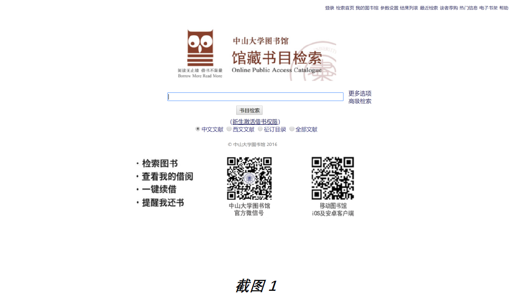
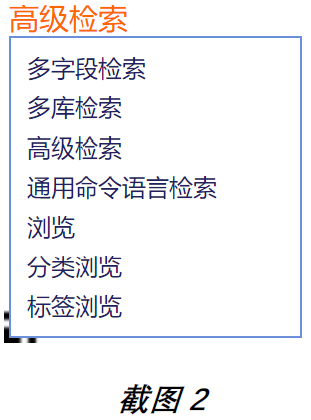
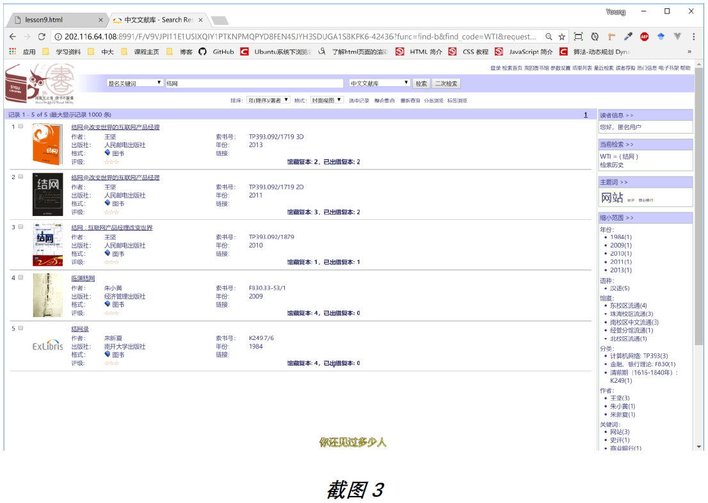
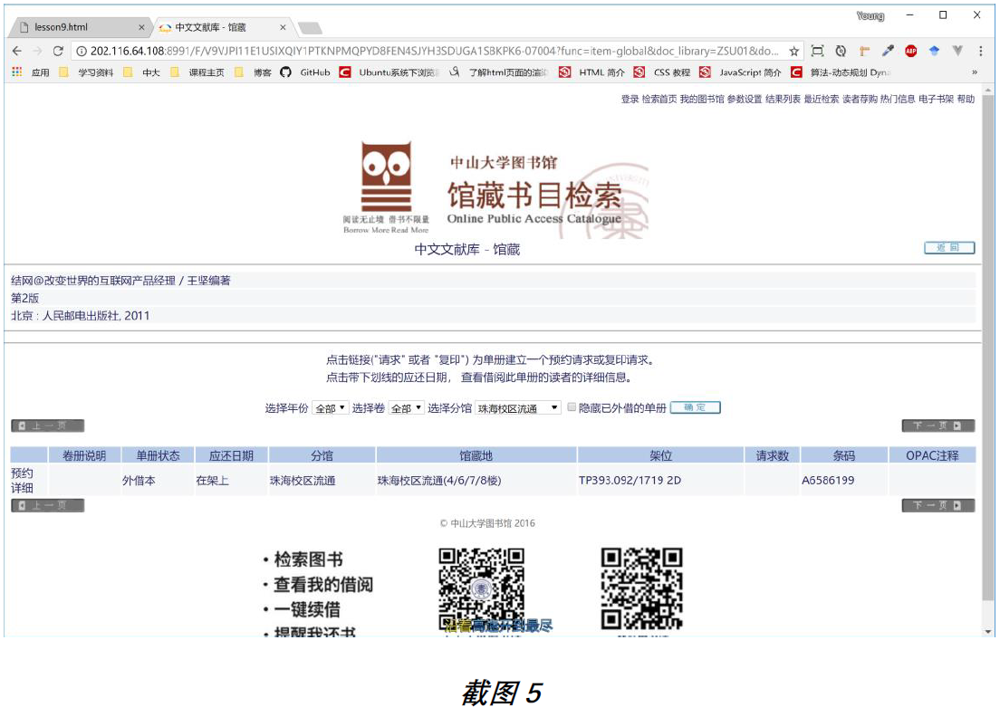
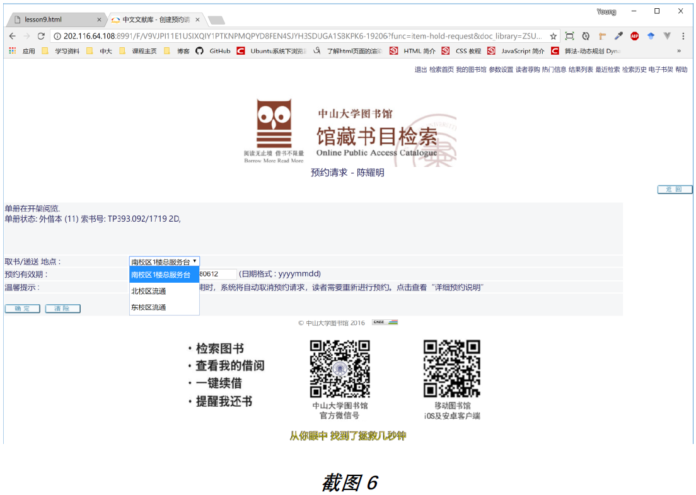
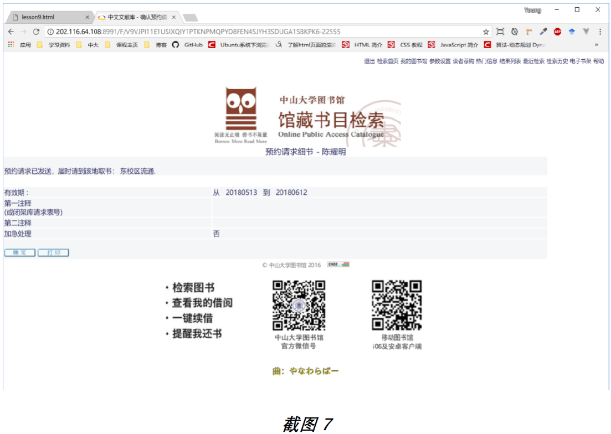

# 建模练习
## Description
>这是一个系统建模作业,系统中的数据库设计和应用逻辑是我们关注的重点。我们在这里将会讨论一个网上图书馆系统的“预约图书”业务,我们将以中山大学的在线图书馆系统为例,地址为 http://library.sysu.edu.cn/。 下一节,我们将会以截图和文字相辅助的形式,展示出图书馆预约图书的业务流程,并说明各种功能和模块间的需求和约束。

>_截图 1_ 是图书馆系统的检索首页,通过输入 __书名、作者、ISBN 或者关键词__ 等都可以对书目进行检索,同时也可以选择不同分类(如图所示,有中文文献、西文文献、征订目录、全部文献)的文献进行搜索。

>如果还想进行更复杂的检索操作,可以点击“高级检索”功能,这时会跳出 __多字段检索、多库检索、分类浏览、标签浏览__ 等选项,由此可以进入高级检索方式。如 _截图 2_ 所示.

>_截图 3_ 显示出,在输入检索关键词后,进入符合条件的图书列表中。在右方菜单中可以对得到的列表进行筛选分类,从而缩小和关键词相关的图书范围。列表中展示了书籍的简略信息,如 __书名、作者、索书号、出版社、年份__ 等。

>在每条书籍条目的右下方,显示出馆藏数目和已出借的数目,读者因此可以确认是否还有库存。当鼠标指向该处时,还会显示出具体哪个分馆的库存。如 _截图 4_ 所示。

>如 _截图 5_ 所示,若某本书籍的馆藏总数>已出借总数,可以点击该条目,进入该条目的操作界面。在这里,我们可以对该书籍进行预约。

>_截图 6_ 进入预约界面,选择取书的地点(四个图书馆中选择其中一个，但不能选
择该图书所在的馆藏图书馆)，并显示出预约的图书信息、预约有效期。

>_截图 7_ 显示了预约成功后的预约信息，包括:
>1. 取书地点。
>2. 有效期。
>3. 是否加急处理。

## Assignment tasks
### Task1
>为“预约图书”作出详细的用例模型。该模型应该采用用户(而不是系统)的视角。因此,例如,“确认预约信息”而不是“显示预约信息”。出于同样的原因,定义用例来处理用户的输入和操作,但并不特定于系统的计算和网页创建活动。显示用例之间的依赖关系以可视化应用程序的类似于工作流程的行为。指定«包含»和«扩展»关系以及任何重要的约束条件。

### Task2
>作“预约图书”用例的活动图。

### Task3
>作“预约图书”的领域模型。

### Task 4
>作被预约的图书的状态模型。

### Task 5
>作“预约图书”的系统顺序图并分析操作协议。
