# 软件设计文档（SD）
## 1. 技术选型
### 1.1. 前端框架：Vue
### 1.2. 后端框架：Django
选择Django作为后端框架的原因是因为Django功能完善，对新手十分友好，基本可以满足所有的开发需求。Django是所有Python的Web框架中官方文档最完善的一个，在开发过程中如果遇到问题，基本都可以在官方文档中找到解决方法。这就给了我们一个权威的途径去应对技术上的问题。可以说是对开发能力不成熟的新手十分友好了，大大地降低了技术风险。此外，Django还自己实现了一个ORM，语法十分地简单，即使不是专业的数据库技术人员也能很快上手，明显地降低了开发成本。最后，Django提供了丰富的功能，比如信号，用来记录数据库操作，admin系统，一个优秀的后台管理系统等等。

### 1.3. 数据库：SQLite3
使用SQLite3作为数据库，主要是因为SQLite3是一个开源的轻量级的嵌入式数据库。简单高效，方便使用。整个数据库存储在一个单一的文件中，数据的导入导出和备份都是复制文件，维护难度低，移植性好，适合于新手。无需单独购买数据库服务，无服务器进程，应用会直接访问包含数据的文件（即SQLite数据库），而不是通过一些端口（port, socket）来交互，配置成本为0，不需要网络配置，也不需要管理，快速而且高效。SQLite 的数据库权限只依赖于文件系统，没有用户帐户的概念，非常使用于我们这样的小程序。相比于其他数据库系统，开源，简单高效等等。  

### 1.4. 缓存系统：Memcached
Memcached是一个自由开源的，高性能，分布式内存对象缓存系统。使用Memcached作为我们程序的缓存系统，是由于其简介而强大，便于快捷开发，减轻了开发的难度。通过缓存数据库查询结果，减少数据库访问次数，以提高动态Web应用的速度、提高可扩展性。相比于其他的缓存系统，Memcached的内存管理制效率高，而且不会造成内存碎片即预先分配一大块内存，然后接下来分配内存就从内存池中分配，这样可以减少内存分配的次数，提高效率。占用较少的CPU资源。**还有一点很重要，Memcached是迄今为止可用于Django的最快，最有效的缓存系统。**  
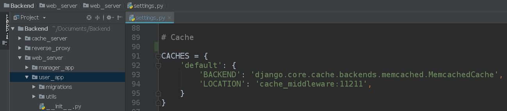

## 2. 架构设计
### 2.1. MTV和前后端分离
我们通过修改Django Web框架的MTV模式来实现可扩展性和可维护性。MTV的全称是Model Template View，其中，Model指的是数据逻辑，Template指的是HTML模板，View指的是视图。视图的意思是用数据渲染模板来生成一个视图，然后返回给调用者。不过我们对MTV做了一点修改，融入了前后端分离的方法进一步降低耦合性。做法就是让视图的职责从返回一个Web页面变成返回一个JSON数据。将渲染模板的工作分离了出来，由前端来负责用调用API返回的JSON数据来渲染模板。以一个后端的APP为例子：
 
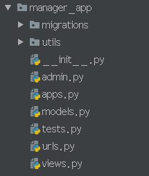
 
其中，models.py就是“M”，“views,py”就是“V”。

### 2.2. 结构化程序设计——程序结构组织
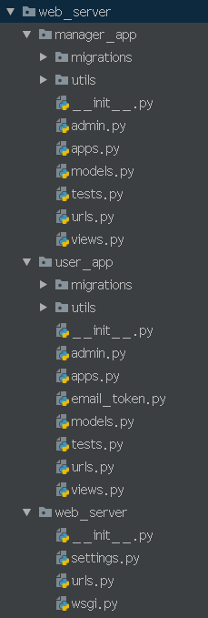

### 2.2.1. 全局配置文件
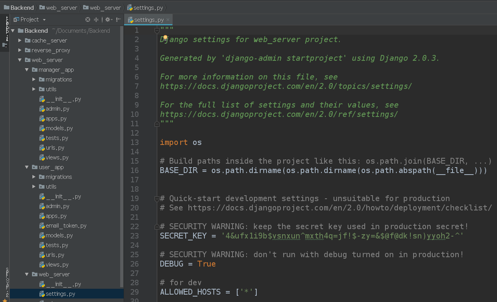

### 2.2.2. 路由配置文件
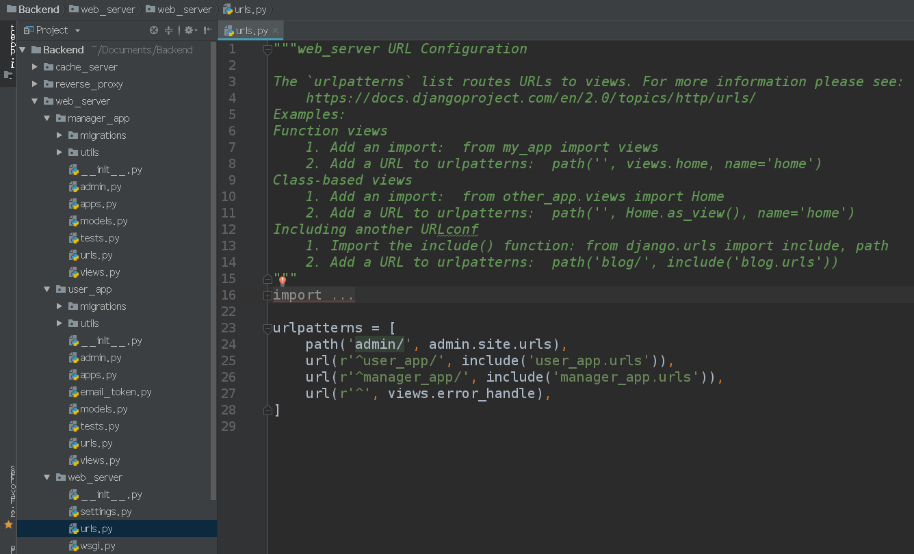
 
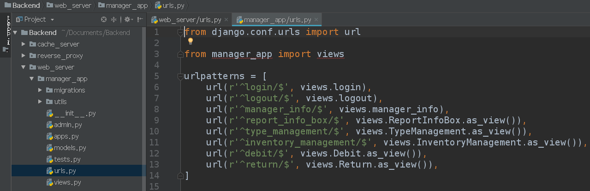
 
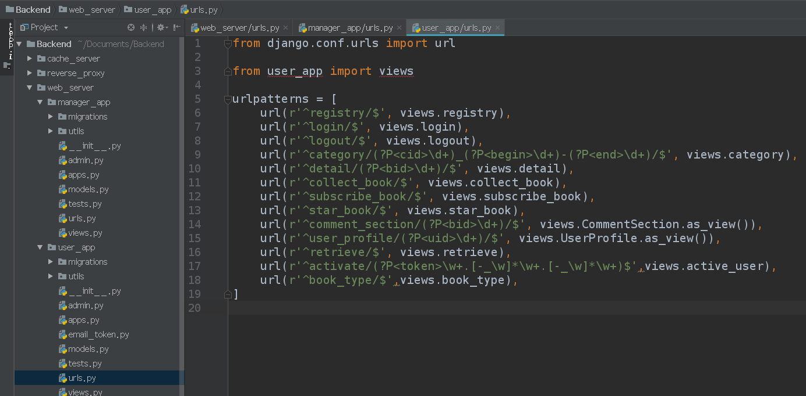

### 2.2.3. 数据逻辑定义文件
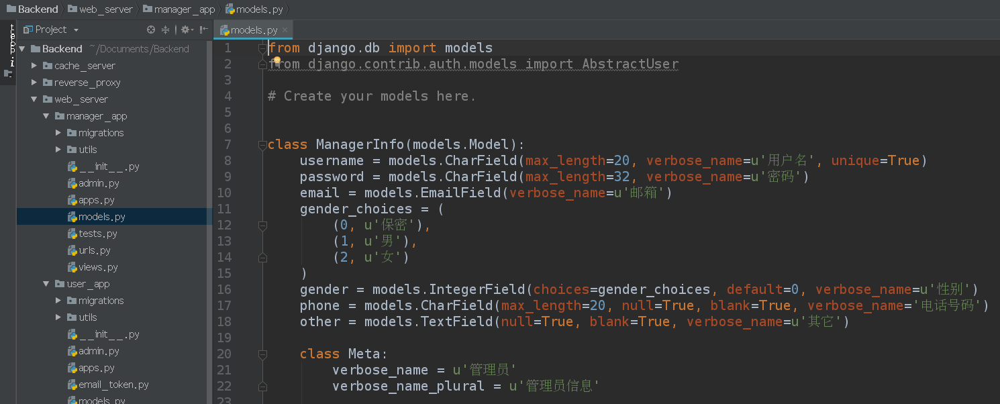
 
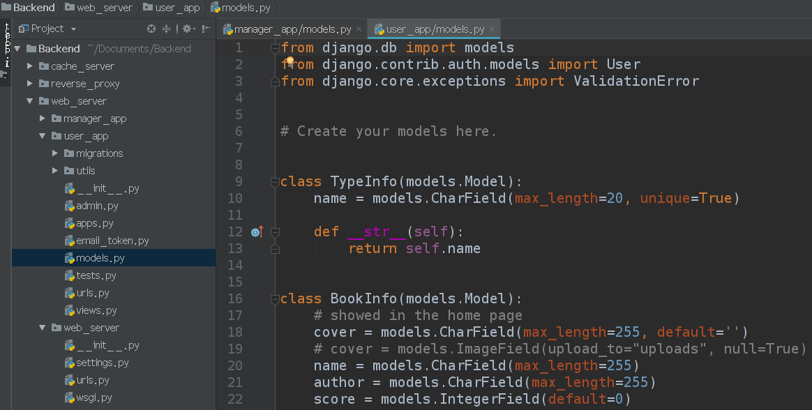

### 2.2. 结构化程序设计——FBV
FBV的全称是Function Base View，指的是用函数实现的视图。将程序结构化为一个个函数，这也是结构化程序设计的体现。具体例子如下：
 
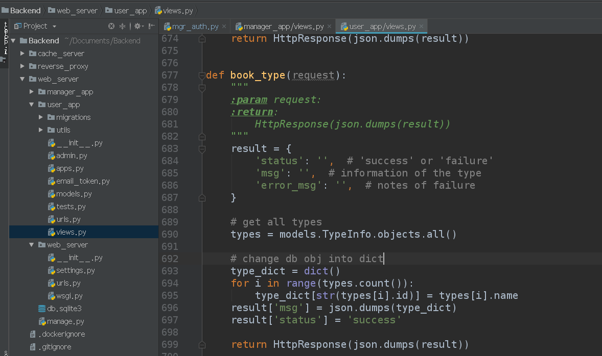
 
这个函数负责处理调用返回全部书籍类型的API。

### 2.3. 面向对象程序设计——CBV
CBV的全称是Class Base View，指的是用类实现的视图。体现了面向对象的设计。具体例子如下：
 
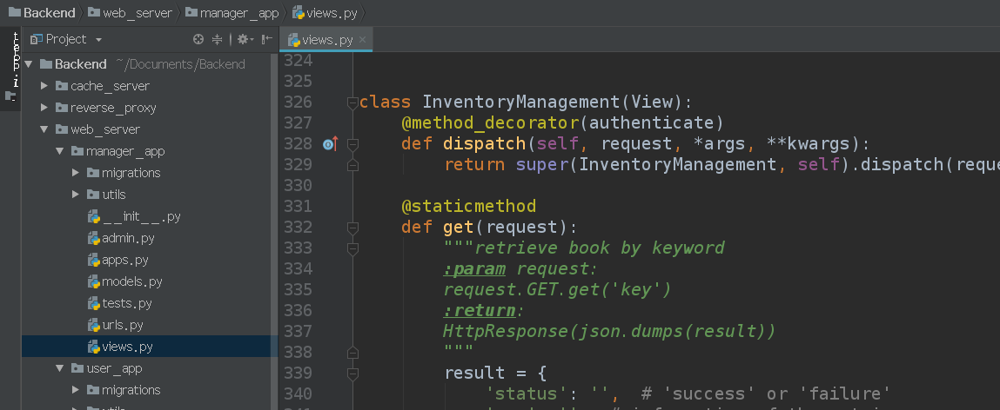
 
这个类负责处理调用与库存管理相关的API。

### 2.4. 设计模式——装饰器
我们用装饰器来实现管理员的认证系统，具体细节如下：
 
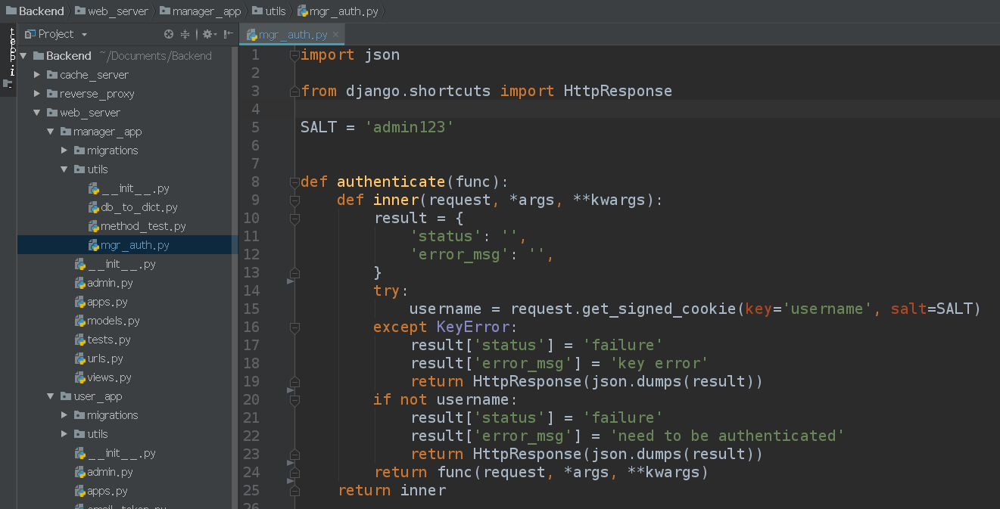
 
使用方法就是在需要认证的逻辑处理函数上加上@authenticate，例如：
 
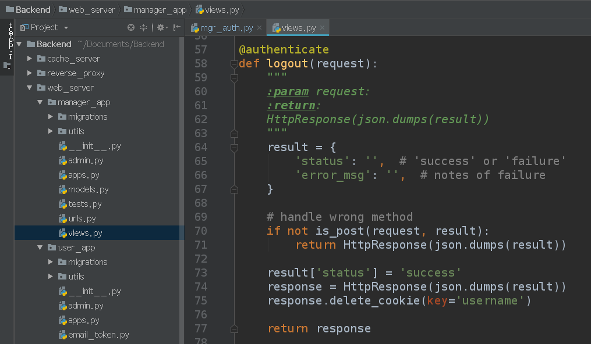

### 2.5. 设计模式——MVVM
前端使用Vue框架开发，它实现了MVVM设计模式。
 
ViewModel将View和Model连接起来，View的变动将自动反映到Model上，同理Model的变动也会反映到View上。具体例子如下：
 
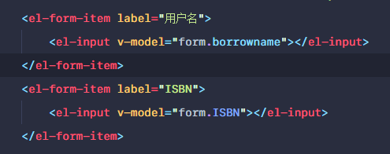
 
使用Vue的v-model命令进行双向绑定，当input内的内容变化或者form数据变化时，都能反映到另一边上。

### 2.6. 组件化开发
构建单页面应用，将单个页面分为一个个的组件，对每个组件进行单独开发，并最终合到一起形成最后的页面。例子如下：
 
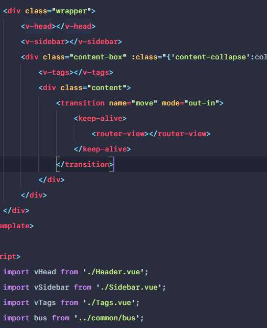
 
此处将页面分成v-head，v-sidebar，v-tags以及router-view四个组件进行开发。

## 3. 模块划分
按功能划分模块，有用户系统、管理员系统、超级管理员系统（admin）。
 
 
前端分为用户系统和管理员系统。
 
用户系统：
 
管理员系统分为主页面以及主页面所使用到的各个组件。
 
common文件夹下为每个页面所共享的组件，page文件夹下为借阅，书籍管理，归还等多个功能的组件，通过router在router-view上进行切换。
 
其中common文件夹下的代码文件及main.js, App.vue为使用他人的代码( https://github.com/lin-xin/vue-manage-system )
 
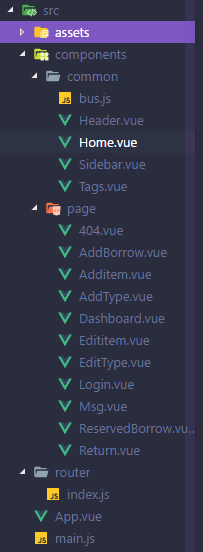
 

后端分为两个提供REST API的用户APP和管理员APP：
 
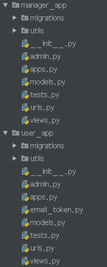
 
超级管理员系统由Django框架提供，我们做一些配置就可以定制一些想要的功能：
 
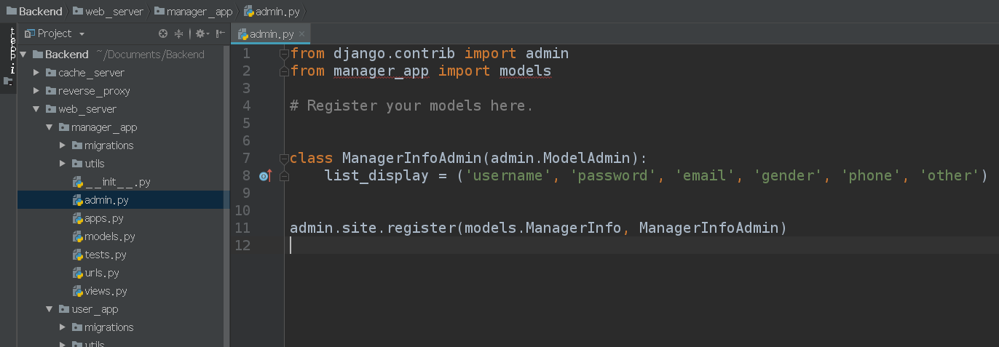
 
这里我们用来管理普通管理员的创建和删除。（超级管理员由用Django提供的命令来注册）
