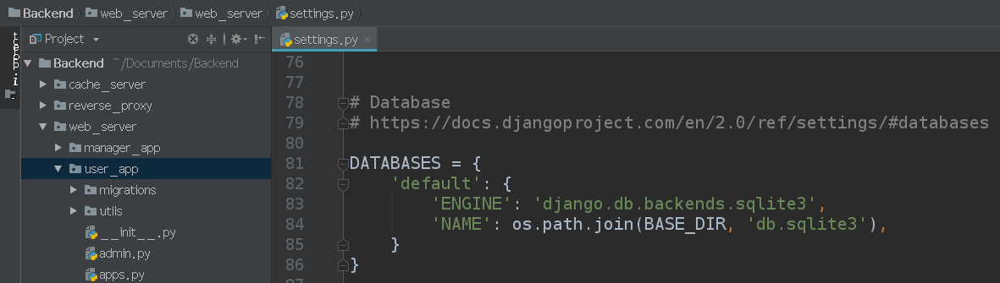

# 软件设计文档（SD）
## 1. 技术选型
### 1.1. 前端框架：Vue
### 1.2. 后端框架：Django
选择Django作为后端框架的原因是因为Django功能完善，对新手十分友好，基本可以满足所有的开发需求。Django是所有Python的Web框架中官方文档最完善的一个，在开发过程中如果遇到问题，基本都可以在官方文档中找到解决方法。这就给了我们一个权威的途径去应对技术上的问题。可以说是对开发能力不成熟的新手十分友好了，大大地降低了技术风险。此外，Django还自己实现了一个ORM，语法十分地简单，即使不是专业的数据库技术人员也能很快上手，明显地降低了开发成本。最后，Django提供了丰富的功能，比如信号，用来记录数据库操作，admin系统，一个优秀的后台管理系统等等。

### 1.3. 数据库：SQLite3

### 1.4. 缓存系统：Memcached

## 2. 架构设计
### 2.1. MTV和前后端分离
我们通过修改Django Web框架的MTV模式来实现可扩展性和可维护性。MTV的全称是Model Template View，其中，Model指的是数据逻辑，Template指的是HTML模板，View指的是视图。视图的意思是用数据渲染模板来生成一个视图，然后返回给调用者。不过我们对MTV做了一点修改，融入了前后端分离的方法进一步降低耦合性。做法就是让视图的职责从返回一个Web页面变成返回一个JSON数据。将渲染模板的工作分离了出来，由前端来负责用调用API返回的JSON数据来渲染模板。以一个后端的APP为例子：
 

 
其中，models.py就是“M”，“views,py”就是“V”。

### 2.2. 结构化程序设计——程序结构组织

### 2.2.1. 全局配置文件

### 2.2.2. 路由配置文件

 

 

### 2.2.3. 数据逻辑定义文件

 

### 2.2. 结构化程序设计——FBV
FBV的全称是Function Base View，指的是用函数实现的视图。将程序结构化为一个个函数，这也是结构化程序设计的体现。具体例子如下：
 

 
这个函数负责处理调用返回全部书籍类型的API。

### 2.3. 面向对象程序设计——CBV
CBV的全称是Class Base View，指的是用类实现的视图。体现了面向对象的设计。具体例子如下：
 

 
这个类负责处理调用与库存管理相关的API。

### 2.4. 设计模式——装饰器
我们用装饰器来实现管理员的认证系统，具体细节如下：
 

 
使用方法就是在需要认证的逻辑处理函数上加上@authenticate，例如：
 

## 3. 模块划分
按功能划分模块，有用户系统、管理员系统、超级管理员系统（admin）。
 
前端：
 

后端分为两个提供REST API的用户APP和管理员APP：
 

 
超级管理员系统由Django框架提供，我们做一些配置就可以定制一些想要的功能：
 

 
这里我们用来管理普通管理员的创建和删除。（超级管理员由用Django提供的命令来注册）
