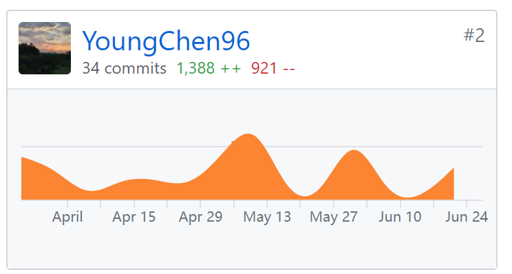
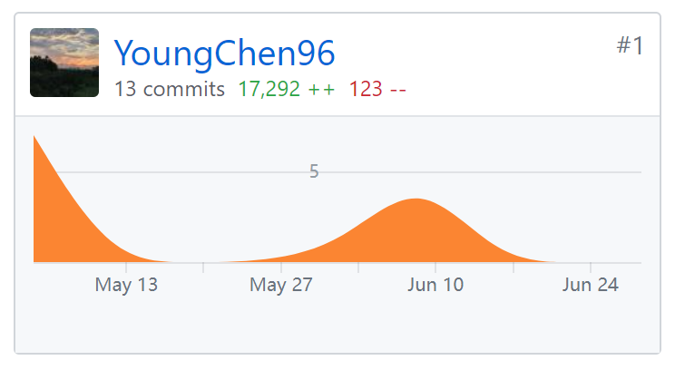

# Yummy的项目总结

## 自我总结

从毫无web项目开发经验到了解web项目开发的完整流程，是课程理论中怎么讲SDLC都体会不到的。

我在“云书架”中承担了项目经理和前端开发的角色，发现两者的工作有点截然分明：PM更多要进行对任务的分配、督促和协调人员工作；开发自然要写代码、解决各种程序的问题等等。两者的工作重合不多，所以要做起事来往往有点忙得焦头烂额。

PM的工作暂且不提，主要说前端开发。第一次完全自己写一个vue项目，vue+vuex+vue-router+axios+iview，对vue熟悉了很多，同时也巩固了之前js的基础。这些在我到时的技术博客将会总结一次。

## PSP 2.1 统计表

|                              |                     |                         |             |
| ---------------------------- | ------------------- | ----------------------- | ----------- |
| **PSP 2.1**                  | **需要做什么**           | **需要的技能**               | **花费时间（h）** |
| **Planning**                 | **计划**              | 统筹规划、熟悉软件开发流程           |             |
| Estimate                     | 估计这个任务需要多少时间        | 对整个任务目标有清晰的认识，对软件开发流程熟悉 | 10          |
| **Development**              | **开发**              | 设计能力、编程能力               |             |
| Analysis                     | 分析需求                | 与客户的良好沟通能力              | 20          |
| Design Spec                  | 生成设计文档              | 良好的写作技能、清晰的结构思维         | 40          |
| Design Review                | 设计复审（和同事审核设计文档）     | 严密谨慎的思维                 | 5           |
| Coding Standard              | 代码规范（为目前的开发制定合适的规范） | 熟悉标准规范并灵活运用             | 2           |
| Design                       | 具体设计                | 熟悉各种数据结构及算法             | 30          |
| Coding                       | 具体编码                | 代码能力、严格遵守编程规范           | 80          |
| Code Review                  | 代码复审                | 软件测试技能                  | 10          |
| Test                         | 测试（包括自测，修改代码，提交修改）  | 熟悉测试工具和模型的使用和遵守测试过程规范   | 80          |
| **Record Time Spent**        | **记录时间花费**          | 严格跟随软件架构与设计步骤           |             |
| **Test Report**              | **测试报告**            | 良好的写作、熟练运用报告撰写工具        | 20          |
| **Size Measurement**         | **计算工作量**           | 熟悉COCOMO模型、准确记录并收集所需数据  | 10          |
| **Postmortem**               | **事后总结**            | 总结反省、不断思考               | 5           |
| **Process Improvement Plan** | **提出过程改进计划**        | 总结反省、不断思考、精益求精、不断创新     |             |

## 个人分支的 GIT 统计报告（截图）

- Dashboard记录：
  
- Frontend记录：

  

  ​

  ## 自认为最得意/或有价值/或有苦劳的工作清单

  合理地分配好团队里每个人的工作（代码和文档），大部分总结性的文档都是我整理和设计的，同时自己的代码工作（整个”云书架“的用户前端系统）也独立地完成了。

  ​

  ## 个人的技术类、项目管理类博客清单

  没有养成良好的写博客习惯，因此没有太多技术博客。

  [CSDN博客](https://blog.csdn.net/Young_Chen_)

  [git page](https://youngchen96.github.io/)

  ​
