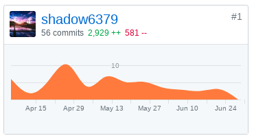

# Final Report
### 简短的课程学习自我总结（400字以内）
很有意义的一次Web开发经历

### PSP 2.1 统计表

|                              |                     |                         |             |
| ---------------------------- | ------------------- | ----------------------- | ----------- |
| **PSP 2.1**                  | **需要做什么**           | **需要的技能**               | **花费时间（h）** |
| **Planning**                 | **计划**              | 统筹规划、熟悉软件开发流程           |             |
| Estimate                     | 估计这个任务需要多少时间        | 对整个任务目标有清晰的认识，对软件开发流程熟悉 | 10          |
| **Development**              | **开发**              | 设计能力、编程能力               |             |
| Analysis                     | 分析需求                | 与客户的良好沟通能力              | 20          |
| Design Spec                  | 生成设计文档              | 良好的写作技能、清晰的结构思维         | 40          |
| Design Review                | 设计复审（和同事审核设计文档）     | 严密谨慎的思维                 | 5           |
| Coding Standard              | 代码规范（为目前的开发制定合适的规范） | 熟悉标准规范并灵活运用             | 2           |
| Design                       | 具体设计                | 熟悉各种数据结构及算法             | 80          |
| Coding                       | 具体编码                | 代码能力、严格遵守编程规范           | 80          |
| Code Review                  | 代码复审                | 软件测试技能                  | 10          |
| Test                         | 测试（包括自测，修改代码，提交修改）  | 熟悉测试工具和模型的使用和遵守测试过程规范   | 80          |
| **Record Time Spent**        | **记录时间花费**          | 严格跟随软件架构与设计步骤           |             |
| **Test Report**              | **测试报告**            | 良好的写作、熟练运用报告撰写工具        | 20          |
| **Size Measurement**         | **计算工作量**           | 熟悉COCOMO模型、准确记录并收集所需数据  | 10          |
| **Postmortem**               | **事后总结**            | 总结反省、不断思考               | 5           |
| **Process Improvement Plan** | **提出过程改进计划**        | 总结反省、不断思考、精益求精、不断创新     |             |

### 个人分支的 GIT 统计报告（不需要解释原因）- 仅需要提交截图
### Dashboard


### Backend


### 自认为最得意/或有价值/或有苦劳的工作清单，含简短说明（一句话）
设计前后端的交互方式

### 个人的技术类、项目管理类博客清单（只需要名称与 url ）
跨站请求伪造（CSRF）的防护措施
```
https://blog.csdn.net/wuchg6/article/details/79955153
```
