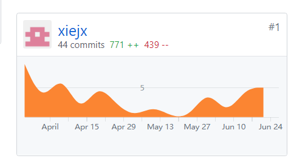
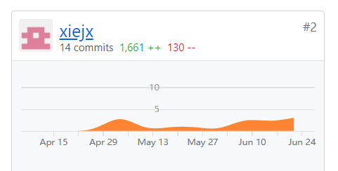

# 15331325项目总结
## 自我总结
模块化的编程有利于本次项目的完成。

## PSP 2.1 统计表
  
| PSP2.1 | Personal Software Process Stages | Time (%) |
| -|- | - |
| **Planning** | **计划** | **8** |
| Estimate | 估计这个任务需要多少时间 | 8 | 
| **Development** | **开发** | **86** | 
| Analysis | 需求分析 (包括学习新技术) | 10 | 
| Design Spec | 生成设计文档 | 8 |
| Design Review | 设计复审 (和同事审核设计文档) | 4 | 
| Coding Standard | 代码规范 (为目前的开发制定合适的规范) | 3 |
| Design | 具体设计 | 10 | 
| Coding | 具体编码 | 30 |
| Code Review | 代码复审 | 10 |
| Test | 测试（自我测试，修改代码，提交修改） | 11 | 
| **Reporting** | **报告** | **6** |
| Test Report | 测试报告 | 2 | 
| Size Measurement | 计算工作量 | 1 | 
| Postmortem & Process Improvement Plan | 事后总结, 并提出过程改进计划 | 3 |

## 个人分支的 GIT 统计报告（截图）
Dashboard仓库  
  
Backend仓库  

## 自认为最得意/或有价值/或有苦劳的工作清单
数据库的初步设计

## 个人的技术类、项目管理类博客清单
[Django简介](https://blog.csdn.net/cjsh_123456/article/details/79920294)
