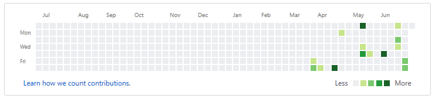
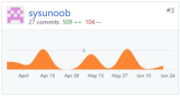
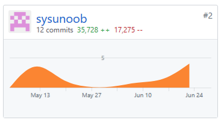

# 15331326_Final Report

## 简短的课程学习自我总结

在这次课程中，我学习到了Vue这个前端框架，了解并实践了互联网应用开发的一些内容，并结合课程的设计理念，编写了基于Vue的云书架管理员系统前端。

感谢shadow6379（WCG）在项目中对于不熟悉前后端编程基础的我所给予的帮助和耐心解答。

## PSP 2.1

| PSP2.1                            | Personal Software Process Stages | Time (%) |
| - | - | - |
| **Planning**                          | **计划**                               | **5**        |
| Estimate                              | 估计这个任务需要多少时间                         | 5            |
| **Development**                       | **开发**                               | **90**       |
| Analysis                              | 需求分析 (包括学习新技术)                       | 10           |
| Design Spec                           | 生成设计文档                               | 5            |
| Design Review                         | 设计复审 (和同事审核设计文档)                     | 5            |
| Coding Standard                       | 代码规范 (为目前的开发制定合适的规范)                 | 2            |
| Design                                | 具体设计                                 | 8            |
| Coding                                | 具体编码                                 | 40           |
| Code Review                           | 代码复审                                 | 3            |
| Test                                  | 测试（自我测试，修改代码，提交修改）                   | 17           |
| **Reporting**                         | **报告**                               | **5**        |
| Test Report                           | 测试报告                                 | 1            |
| Size Measurement                      | 计算工作量                                | 1            |
| Postmortem & Process Improvement Plan | 事后总结, 并提出过程改进计划                      | 3            |

## 个人分支的 GIT 统计报告
### 个人页面

### Dashboard仓库

### Frontend仓库

## 自认为最得意/或有价值/或有苦劳的工作清单

1.  基于Element UI的多选器设计的类型展示表单框：将类型设计为数组，包含一本书的所有类型，并在多选器上展示，并可实时修改。
2.  前后端交互测试：率先进行前后端交互测试，解决了跨域，传输格式等问题，给后来的测试提供了指导意义。

## 个人的技术类、项目管理类博客清单

Vue极简快速入门手册：https://www.jianshu.com/p/b5cb9b30ffd8
